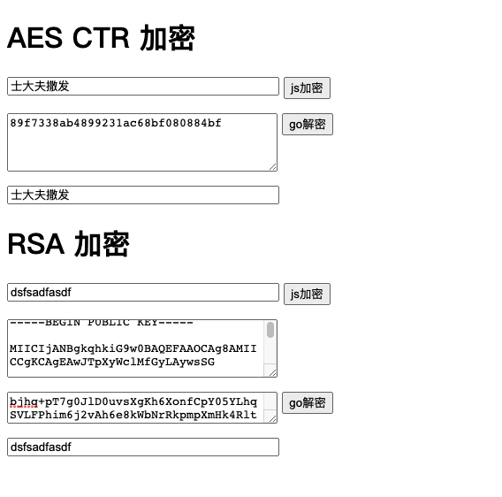

# Go-Javascript 加解密

本项目提供了一份在Js中加密go端解密的样例代码,包括aes和rsa两种方法



## 注意事项

rsa私钥生成  
```
ssh-keygen -m PEM -t rsa -b 4096
```

rsa公钥生成  
```
# mykey.pem是上一步中生成的私钥
openssl rsa -in mykey.pem -pubout > mykey.pub
```